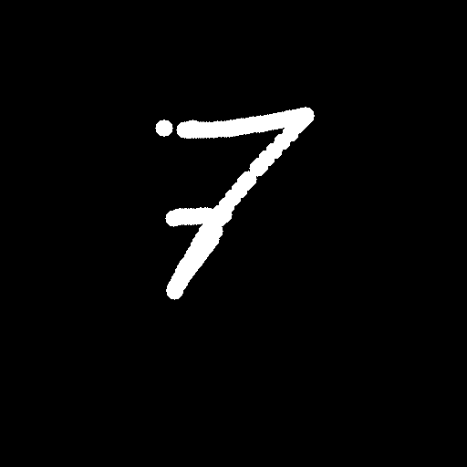

Detect Writed Number 2.0 ***(runner)***
----------------
~~Что за проект? Что он делает?~~

**Detect Writed Number** - задача по распознаванию рукописных [цифр][3]. В общем смысле ее можно разбить на две части: [обучение и сохранение модели с настроенными весами][1] и [графическое окно для рисования цифры][2].

~~Таких проектов миллион. Не изобретай велосипед и используй Feature Extraction.~~

Поскольку подобных задач в сети куча, то в каком-то смысле ее стоит рассматривать с точки зрения тренировки и опыта. _Pet project_.

##Example:

**Input:**



**Output:**

`[INFO]	User painted '7'`

##Описание:

Является логическим продолжением [Части №1][1]. Вкратце о том, что происходит в предыдущей части:
1. Обучение модели на датасете **MNIST**;
2. Тестирование модели;
3. Сохранение модели в формате **.pt**  `torch.save(mnist_net, 'mnist_full_model.pt')`.

...Последний пункт плавно перетекает в текущую часть проекта.
В данной части реализация окна для рисования, распознавания и сохранения нарисованного изображения.


- ###Подготовка модели:

Сохраненную модель `mnist_full_model.pt` выгружаем, фискируем с помощью eval() и заскриптовываем посредством `TorchScript`, который позволяет сконвертировать обученную модель в кросс-языковой формат для дальнейшего использования на С++.


- ###Графическое окно:

Графическое окно реализовано с помощью библиотеки OpenCV в силу простой конвертации изображения между cv::Mat и torch::Tensor :
```
cv::Mat cvImage;
// ...
torch::Tensor tensorImage = torch::from_blob(cvImage.data, { 1, cvImage.rows, cvImage.cols },torch::kByte).to(deviceType);
tensorImage = tensorImage.toType(torch::kFloat);

auto output = scriptedModel->forward({ tensorImage }).toTensor();
```

#####Руководство по рисованию:

1. В появившемся окне зажмите левую кнопку мыши и нарисуйте цифру.
2. Нажмите на правую кнопку мыши после окончания рисования.
3. В консоле выйдет информация о том, какую цифру нарисовали `[INFO]	User painted '8'`.
4. Нарисованное изображение будет сохранено в папку _./predicted_. Формат имени изображения: `предикт___дата:рисования.png`. Пример: `8___2023-02-25_18:01:23.png`.
5. Нажмите _"q"_ для выхода из программы.


- ###Предобработка изображения:

Поскольку [MNIST-датасет][7] имеет свой общий формат для каждого изображения:
> The original black and white (bilevel) images from NIST were size normalized to fit in a 20x20 pixel box while preserving their aspect ratio. The resulting images contain grey levels as a result of the anti-aliasing technique used by the normalization algorithm. the images were centered in a 28x28 image by computing the center of mass of the pixels, and translating the image so as to position this point at the center of the 28x28 field.

...то необходимо добавить такую предобработку, чтобы на вход в нейросеть изображение падало в соответствии с MNIST форматом.

#####Ключевые моменты:

1. Для оптимальной работы используется [Гауссово размытие][4], если нарисованное изображение достаточно большое.
2. [Bounding box][5] вычисляется по первому нарисованному пикселю.
3. Вычисляется центр масс для bounding box'а с последующим сдвигом к центру с помощью [Аффинного преобразования][6].


- ###Нейросеть:

Используется предобученная(и затем заскриптованная) нейросеть из [первой части][1] данного проекта. Для внедрения обученной модели потребуется установленная библиотека _libtorch_.
Пример загрузки и использования нейросети с помощью библиотеки Torch на С++:
```
torch::NoGradGuard noGrad; // обязательно, чтобы не накапливать градиенты. тут оно не нужно

torch::jit::Module model = torch::jit::load(sPath, torch::kCUDA);
torch::Tensor inputs;
// ...

torch::Tensor outputs = m_pModel->forward({ inputs }).toTensor();
outputs = outputs.argmax(1).toType(torch::ScalarType::Long);
```


##Заключение:
Была проделана немалая исследовательская работа на тему интеграции нейросети с С++, которая пока что остается чуть-чуть сырой.

#####Пункты, которыми проект будет дополняться со временем:

1. Поддержка расширенных настроек через конфигурационный файл.
2. Логгирование полезной информации.
3. Работа из-под коробки. Скачали, собрали, запустили, нарисовали.
4. Threshold для выхода из нейросети, чтобы нарисованные человечки не предсказывались как 4 или 8 :)


[1]: https://github.com/AidarAzizov
[2]: https://github.com/AidarAzizov
[3]: https://ru.wikipedia.org/wiki/Цифры
[4]: https://ru.wikipedia.org/wiki/Размытие_по_Гауссу
[5]: https://gamedev.ru/code/terms/Bounding_Box
[6]: https://ru.wikipedia.org/wiki/Аффинное_преобразование
[7]: http://yann.lecun.com/exdb/mnist/